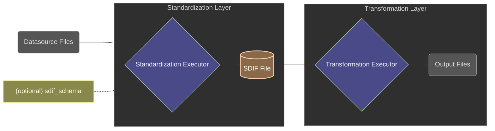
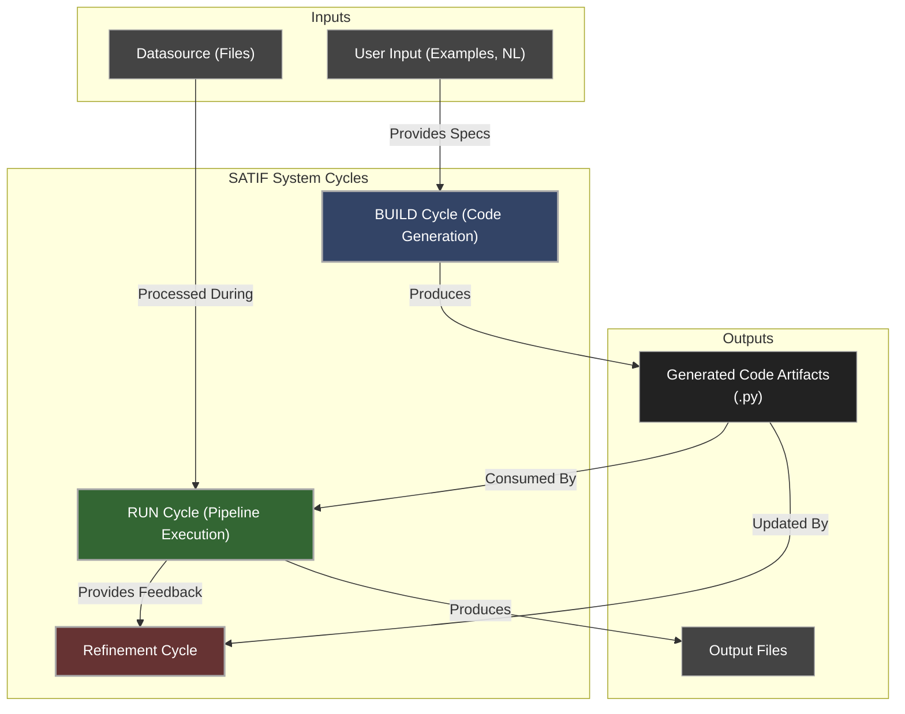

# Overview

> **SATIF is an AI toolkit for simplifying and automating the transformation of ANY input files into ANY output files.**

## Core Architecture

SATIF utilizes a two-layer architecture:

1. **Standardization Layer**: Ingests heterogeneous source files (CSV, Excel, PDF, XML, etc.) and transforms them into SDIF, a structured intermediate format.
2. **Transformation Layer**: Applies business logic to the standardized data to generate the target output files, with transformation code either written manually or generated by AI.

## SDIF: The Intermediate Format

SDIF (Stantardized Data Interoperable Format) is the standardized SQLite representation that:

- Stores a [Datasource](terminology.md) as structured tables alongside JSON objects and binary media
- Maintains rich metadata about data origins, structure, and relationships
- Provides direct SQL queryability for complex transformations
- Creates a consistent interface between standardization and transformation

## Workflow

1. **BUILD**: Generate transformation code via AI based on example inputs/outputs and instructions
2. **RUN**: Execute the full pipeline (standardization → transformation) on new inputs
3. **REFINE**: Iteratively improve the pipeline through feedback and error handling

SATIF eliminates the need to write custom parsing logic, letting you focus on your business transformation requirements.

## Key Capabilities

- **Any Format Support**: Process virtually any input, even challenging unstructured content (PDFs, complex Excel sheets)
- **AI-Powered Code Generation**: Automatically generate transformation code from examples and natural language instructions
- **Robust Schema Enforcement**: Handle input data drift and schema inconsistencies through configurable validation
- **SQL-Based Data Processing**: Query and manipulate all data using SQL
- **Decoupled Processing Stages**: Standardize once, transform many times with different logic
